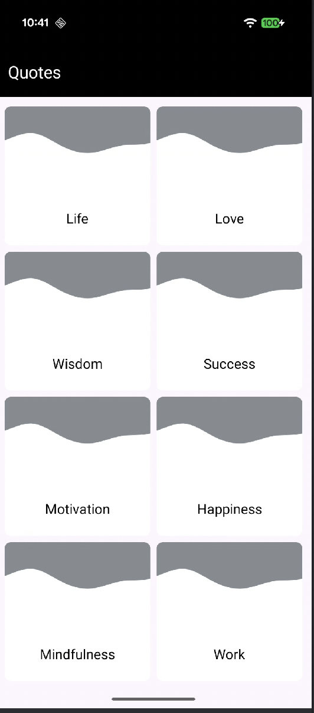
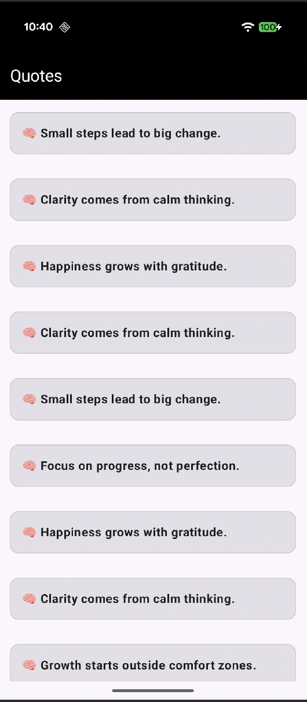

# Quotes App 📚

A modern Android application built with Jetpack Compose that displays inspirational quotes organized by categories. The app fetches quotes from JSONBin.io API and presents them in a beautiful, user-friendly interface.

## Features ✨

- **Category Selection**: Browse quotes by different categories (Life, Love, Wisdom, Success, etc.)
- **Quote Details**: View all quotes for a selected category
- **Modern UI**: Built with Material Design 3 and Jetpack Compose
- **Navigation**: Smooth navigation between screens using Jetpack Navigation Compose
- **Network Logging**: HTTP request/response logging for debugging
- **MVVM Architecture**: Clean architecture pattern with ViewModels and Repository
- **Dependency Injection**: Hilt for managing dependencies

## Tech Stack 🛠️

- **Language**: Kotlin
- **UI Framework**: Jetpack Compose
- **Architecture**: MVVM (Model-View-ViewModel)
- **Dependency Injection**: Hilt
- **Networking**: Retrofit + OkHttp
- **JSON Parsing**: Gson
- **Coroutines**: Kotlin Coroutines for asynchronous operations
- **Navigation**: Jetpack Navigation Compose
- **Material Design**: Material 3

## Screenshots 📱

<table>
<tr>
<td width="50%">

**Category Selection Screen**

The main screen displays all available quote categories in a beautiful grid layout. Users can tap on any category to view quotes in that category.



**Features:**
- Grid layout with 2 columns
- Rounded corner cards with category images
- Black toolbar with white "Quotes" title
- Smooth navigation to quote details

</td>
<td width="50%">

**Quote Details Screen**

Displays all quotes for the selected category in a scrollable list. Each quote is presented in a card with clear typography.



**Features:**
- Scrollable list of quotes
- Material 3 cards with borders
- Dynamic toolbar title showing category name
- Clean and readable quote presentation

</td>
</tr>
</table>

## Project Structure 📁

```
app/src/main/java/com/example/quotes/
├── api/
│   └── QuotesApi.kt              # Retrofit API interface
├── di/
│   └── NetworkModule.kt          # Hilt dependency injection module
├── models/
│   ├── Quotes.kt                 # Data model for quotes collection
│   └── QuotesItem.kt             # Data model for individual quote
├── repository/
│   └── QuotesRepository.kt       # Repository for data management
├── screens/
│   ├── QuotesCategoryScreen.kt   # Category selection screen
│   └── QuotesDetailsScreen.kt    # Quote details screen
├── viewmodels/
│   ├── QuotesCategoryViewModel.kt # ViewModel for category screen
│   └── QuotesDetailsViewModel.kt # ViewModel for details screen
├── ui/
│   └── theme/                    # App theming
├── MainActivity.kt                # Main activity
└── QuotesApplication.kt          # Application class
```

## Setup Instructions 🚀

### Prerequisites

- Android Studio Hedgehog (2023.1.1) or later
- JDK 11 or higher
- Android SDK with API level 24 (minimum) and 36 (target)
- Gradle 8.13.2

### Installation

1. **Clone the repository**
   ```bash
   git clone <your-repo-url>
   cd quotes
   ```

2. **Open in Android Studio**
   - Open Android Studio
   - Select "Open an Existing Project"
   - Navigate to the cloned directory

3. **Sync Gradle**
   - Android Studio will automatically sync Gradle dependencies
   - If not, click "Sync Now" or go to `File > Sync Project with Gradle Files`

4. **Run the app**
   - Connect an Android device or start an emulator
   - Click the "Run" button or press `Shift + F10`

## API Information 🌐

The app uses JSONBin.io API to fetch quotes data:
- **Base URL**: `https://api.jsonbin.io/`
- **Endpoint**: `v3/b/694e220dd0ea881f4040cd2a?meta=false`
- **JSONPath Filtering**: Uses `X-JSON-Path` header for filtering quotes by category

### API Endpoints

1. **Get All Quotes**
   - Method: `GET`
   - Path: `v3/b/694e220dd0ea881f4040cd2a?meta=false`

2. **Get Quotes by Category**
   - Method: `GET`
   - Path: `v3/b/694e220dd0ea881f4040cd2a?meta=false`
   - Header: `X-JSON-Path: quotes[?(@.category=="CategoryName")]`

3. **Get Categories List**
   - Method: `GET`
   - Path: `v3/b/694e220dd0ea881f4040cd2a?meta=false`
   - Header: `X-JSON-Path: quotes..category`

## Dependencies 📦

### Core Dependencies

- **Jetpack Compose BOM**: 2024.09.00
- **Material 3**: Latest
- **Hilt**: 2.51.1
- **Retrofit**: 2.11.0
- **OkHttp**: 4.12.0
- **Coroutines**: 1.9.0
- **Navigation Compose**: 2.8.4

See `gradle/libs.versions.toml` for complete dependency versions.

## Architecture 🏗️

The app follows **MVVM (Model-View-ViewModel)** architecture pattern:

- **Model**: Data classes (`Quotes`, `QuotesItem`)
- **View**: Compose UI screens (`QuotesCategoryScreen`, `QuotesDetailsScreen`)
- **ViewModel**: State management (`QuotesCategoryViewModel`, `QuotesDetailsViewModel`)
- **Repository**: Data source abstraction (`QuotesRepository`)
- **API**: Network layer (`QuotesApi`)

### Data Flow

```
UI (Compose) → ViewModel → Repository → API → Network
                ↓
            StateFlow
                ↓
            UI Updates
```

## Key Components 🔧

### NetworkModule
- Provides Retrofit instance
- Configures OkHttpClient with logging interceptor
- Sets up Gson converter

### QuotesRepository
- Manages quotes data using StateFlow
- Handles API calls
- Exposes reactive data streams

### ViewModels
- Manage UI state
- Handle business logic
- Connect Repository to UI

## Logging 📝

The app includes HTTP logging interceptor that logs:
- Request headers and body
- Response headers and body

Logs can be viewed in Logcat with the tag `OkHttp`.

## Build Variants 🔨

- **Debug**: Includes logging and debugging tools
- **Release**: Optimized build (ProGuard disabled by default)

## Minimum Requirements 📋

- **Min SDK**: 24 (Android 7.0)
- **Target SDK**: 36 (Android 14)
- **Compile SDK**: 36

## Author 👤

Mukesh Kumar Patel

## Acknowledgments 🙏

- Quotes data provided by JSONBin.io
- Built with Jetpack Compose and modern Android development tools

---

**Note**: Make sure to add your API keys or configuration if required for production builds.

